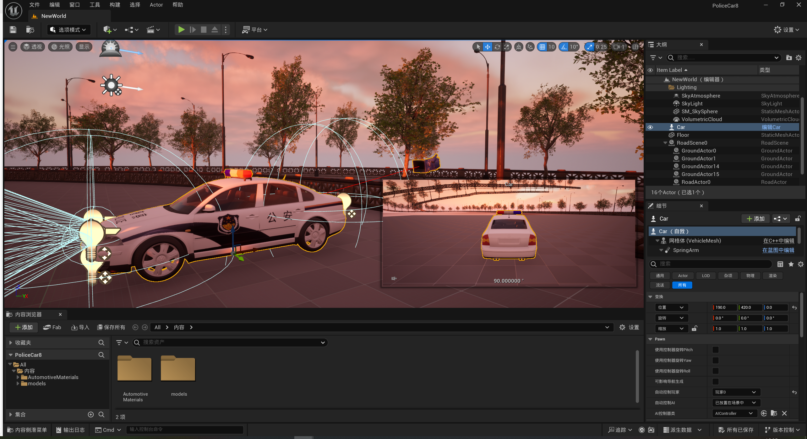

  # UERoadBuilder

  本项目是基于[RoadBuilder](https://github.com/fullike/RoadBuilder)项目二次开发，在原始项目的编译中会报以下错误：

  ```shell
  [4/10] Compile Module.RoadBuilderEditor.cpp
  G:\UE5Plugins\build\RoadBuilder_Build\HostProject\Plugins\RoadBuilder\Source\RoadBuilderEditor\Private\EditorExtensions.cpp(27): fatal error C1083: 无法打开包括文件: “ThirdParty/nanosvg/src/nanosvg.h”: No such file or directory
  ```

  该错误的意思大致是无法打开`ThirdParty/nanosvg/src/nanosvg.h`，通过查找发现该项目确实没有该文件。

  通过在github上搜索，发现nanosvg是[Unreal Engine](https://github.com/chenyong2github/UnrealEngine)项目中的一个包，地址为：`UnrealEngine/Engine/Source/ThirdParty/nanosvg/`

  将该包放到`RoadBuilder\Source\ThirdParty`下，再把该`nanosvg`包中的`nanosvg.Build.cs`和`nanosvg.tps`删除

  

  RoadBuilder是Unreal Engine的一个插件，可以在Unreal Editor当中创建复杂的道路

  RoadBuilder可以编辑道路的每个细节，包括车道类型、宽度、车道标记、交通标志、斑马线等，而其内置的道路样式允许您快速创建各种类型的道路，例如街道、高速公路、坡道、高架道路和隧道。

  RoadBuilder还可以为 PCG 系统创建地面网格和边界样条，以生成更多细节。

  RoadBuilder 创建的道路可以导出为 OpenDrive 格式，以便在各种自动驾驶仿真环境中使用。

  ### 特性

  - 螺旋线和曲率混合支持道路规划。
  - 各种内置道路样式（街道、高速公路、高架、隧道）和相应的道路道具生成。
  - 道路劈砍和劈裂。
  - 交汇点、匝道和分叉生成。
  - 车道划分和偏移调整。
  - 支持各种车道标记和交通标志。
  - 生成“血腥区域”或“暴力场景”
  - 无缝和精细的地面网格生成以及 PCG 图形的样条边界
  - SVG 文件导入。
  - OpenDrive （xodr） 格式导出。

  ### 视频教程

  - https://www.youtube.com/watch?v=zGpPd4RAneQ&list=PLCWhWOgVmdwkOBGElYEPumnCXL12zEtwE

  ### 编译

  * 我编译了`UE 5.1.1`版本和`UE 5.4.4`版本，中间的`UE 5.2.1`和`UE 5.3.2`应该都是没问题的，至于最高版本的`UE 5.5.3`还待测试。

  * 对于`UE 5.4.4`可以正常使用，但`UE 5.1.1`插件的自带资产由于版本兼容问题，就没有自带的路面资产

  * 对于`UE 5.1.1`需要安装`visual studio 2019`相关工具，对于`UE 5.4.4`需要安装`visual studio 2022`相关工具
  
  1. 由于原始仓库中没有`nanosvg`模块，但本仓库已经将该模块的代码加上。所以对于本仓库就不需要将[Unreal Engine](https://github.com/chenyong2github/UnrealEngine)中的`UnrealEngine/Engine/Source/ThirdParty/nanosvg/`包移动到`RoadBuilder\Source\ThirdParty`下，`nanosvg`包中的`nanosvg.Build.cs`和`nanosvg.tps`也已经被删除，用户可以跳过本步骤
  2. 对于原始仓库需要将 [Content.zip ](https://drive.google.com/file/d/1Es8YJwpEvMFxoh7SPojt0weMluLXaYZE/view?usp=sharing)解压后将里面的内容复制到`RoadBuilder\Content`中，该`Content`目录中应该一些UE资产，也就是插件默认提供的路面样式，对于本仓库的使用用户也可以跳过本步骤
  3. 在UE5安装成功后，查找UE5的安装位置，在下面的`Engine\Build\BatchFiles`目录有一个`RunUAT.bat`脚本，这里我的地址为：`D:\software\EPIC\UE_5_1\UE_5.1\Engine\Build\BatchFiles`
  4. 编译的命令为：`RunUAT.bat BuildPlugin -Plugin="D:\test\RoadBuilder\RoadBuilder.uplugin" -Package="G:\UE5Plugins\build\RoadBuilder_Build" -TargetPlatforms=Win64`
  
     **其中**：
  
     1. `-Plugin`：后面的是插件路径
     2. `-Package`：后面是插件编译好的路径
     3. `-TargetPlatforms`：后面是只编译win平台，不加这个我的会报错，说找不到`Linux`的东西
   5. 当最后倒数第3行出现`BUILD SUCCESSFUL`则说明编译成功了

  ### 使用
  在项目目录下（也就是`xxx.uproject`所在目录）新建`Plugins`目录，在该目录下将编译好的插件放入`Plugins`目录中


  ### 如何使用
  
  - Clone this repo to <u>project/plugins/RoadBuilder</u> folder
  - Extract [Content.zip](https://drive.google.com/file/d/1Es8YJwpEvMFxoh7SPojt0weMluLXaYZE/view?usp=sharing) to <u>project/plugins/RoadBuilder/Content</u> folder